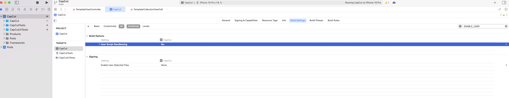

X—CODE编译报错：
Sandbox: rsync.samba(3337) deny(1) file-write-create /Users/bytedance/Library/Developer/Xcode/DerivedData/CapCut-dunaxnsaywjzpggwofcltchvzpyr/Build/Products/Debug-iphonesimulator/CapCut.app/Frameworks/CHTCollectionViewWaterfallLayout.framework/_CodeSignature

Sandbox: rsync.samba(3338) deny(1) file-write-create /Users/bytedance/Library/Developer/Xcode/DerivedData/CapCut-dunaxnsaywjzpggwofcltchvzpyr/Build/Products/Debug-iphonesimulator/CapCut.app/Frameworks/CHTCollectionViewWaterfallLayout.framework/.CHTCollectionViewWaterfallLayout.oBfYSB

Sandbox: rsync.samba(3338) deny(1) file-write-create /Users/bytedance/Library/Developer/Xcode/DerivedData/CapCut-dunaxnsaywjzpggwofcltchvzpyr/Build/Products/Debug-iphonesimulator/CapCut.app/Frameworks/CHTCollectionViewWaterfallLayout.framework/.Info.plist.RmRL6c

## 解决办法：

设置 USER_Script_Sandboxing 为No

